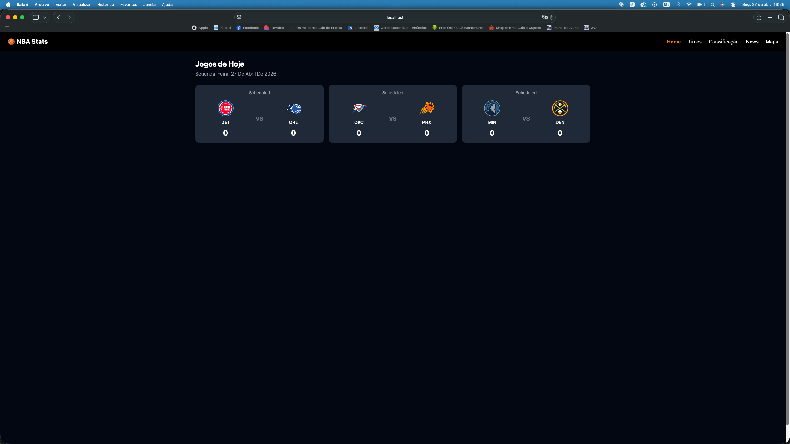
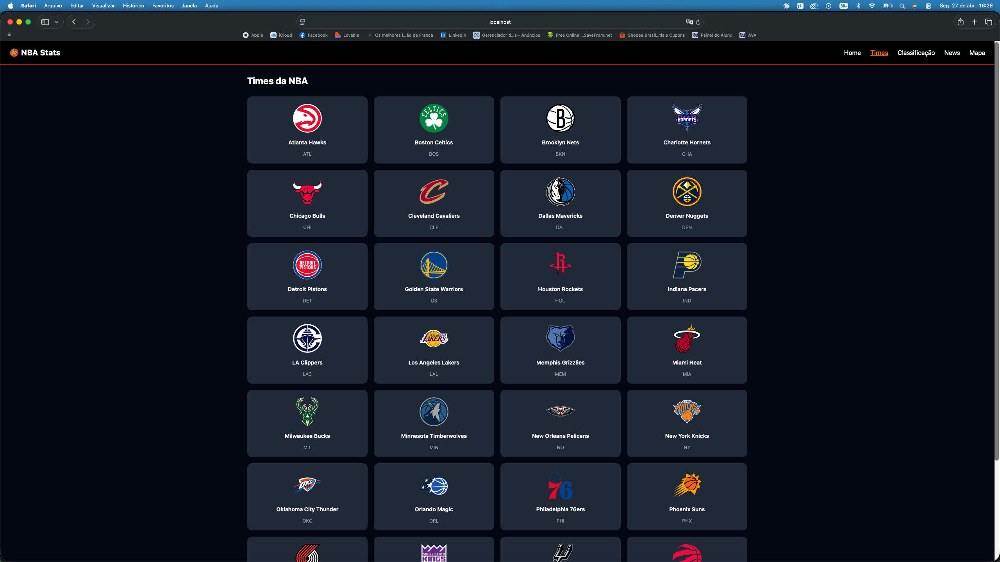
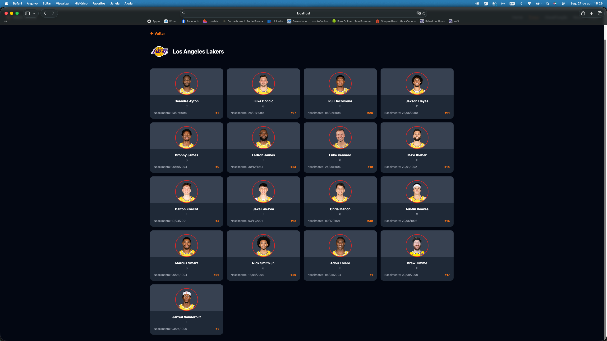
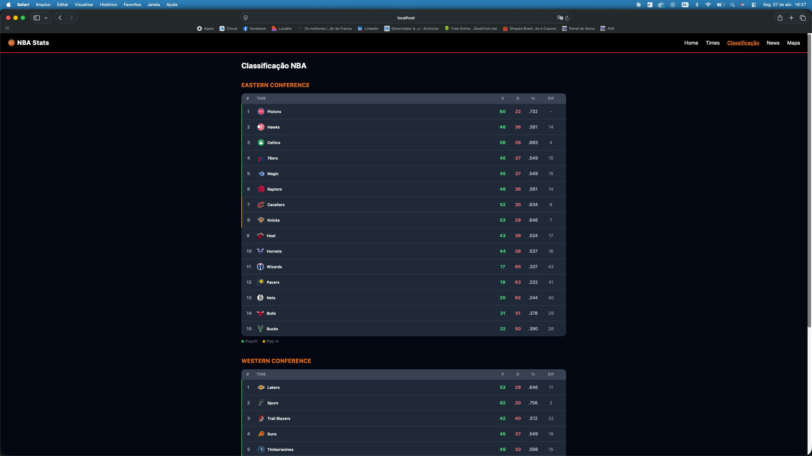
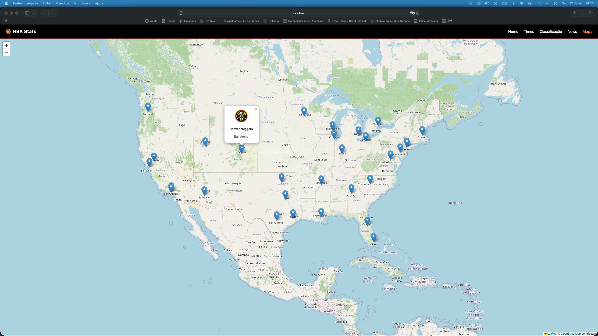

# 🏀 NBA Stats

Aplicação web desenvolvida em React que consome a API pública da ESPN para exibir informações em tempo real da NBA: jogos do dia, lista de times, elenco de jogadores, classificação por conferência, últimas notícias e mapa interativo com os ginásios.

🔗 **[Acessar aplicação online](https://Jgiantg.github.io/NBA-Stats-Des.-Software-Web)**

---

## Tecnologias utilizadas

| Tecnologia | Uso |
|---|---|
| React 18 | Biblioteca principal de UI |
| Vite | Bundler e servidor de desenvolvimento |
| React Router DOM v6 | Roteamento e rotas dinâmicas |
| Tailwind CSS | Estilização |
| React Leaflet + Leaflet | Mapa interativo |
| ESPN Public API | Dados reais da NBA |
| gh-pages | Deploy no GitHub Pages |

---

## Como rodar o projeto

### Pré-requisitos

- Node.js 18+ instalado
- npm

### Instalação e execução

```bash
# Clone o repositório
git clone https://github.com/SEU-USUARIO/nba-stats.git

# Acesse a pasta do projeto
cd nba-stats

# Instale as dependências
npm install

# Inicie o servidor de desenvolvimento
npm run dev
```

A aplicação abrirá em `http://localhost:5173/nba-stats/`

### Build para produção

```bash
npm run build
```

### Deploy no GitHub Pages

```bash
npm run deploy
```

---

## Funcionalidades

- **Home** — Jogos do dia com placar ao vivo, logos dos times e status da partida
- **Times** — Grid com os 30 times da NBA, logo e abreviação. Clique em um time para ver o elenco
- **Elenco** — Página dinâmica com foto, posição, data de nascimento e número de cada jogador
- **Classificação** — Tabela por conferência (Leste e Oeste) com vitórias, derrotas e percentual de aproveitamento, destacando posições de playoff e play-in
- **News** — Últimas notícias da NBA com foto, título, descrição e link para a matéria original
- **Mapa** — Mapa interativo com os 30 ginásios da NBA. Clique em um marcador para ver o nome do time e da arena

---

## Arquitetura da aplicação

```
nba-stats/
│
├── index.html                  ← Entry point do Vite
│
├── src/
│   ├── main.jsx                ← Monta o React no DOM
│   ├── App.jsx                 ← Define todas as rotas
│   ├── index.css               ← Tailwind CSS
│   │
│   ├── components/
│   │   ├── Navbar.jsx          ← Barra de navegação com links ativos
│   │   ├── GameCard.jsx        ← Card de jogo (logos, placar, status)
│   │   ├── PlayerCard.jsx      ← Card de jogador (foto, stats)
│   │   └── Loading.jsx         ← Spinner de carregamento
│   │
│   └── pages/
│       ├── Home.jsx            ← /           → Jogos do dia
│       ├── Teams.jsx           ← /teams      → Lista de times
│       ├── TeamRoster.jsx      ← /teams/:id  → Elenco (rota dinâmica)
│       ├── Standings.jsx       ← /standings  → Classificação
│       ├── News.jsx            ← /news       → Notícias
│       └── NBAMap.jsx          ← /map        → Mapa dos ginásios
│
├── vite.config.js
├── tailwind.config.js
└── package.json
```

### Rotas da aplicação

| Rota | Página | Descrição |
|---|---|---|
| `/` | Home | Jogos do dia via scoreboard da ESPN |
| `/teams` | Times | Grid com todos os 30 times |
| `/teams/:teamId` | Elenco | Elenco do time (rota dinâmica) |
| `/standings` | Classificação | Tabela por conferência |
| `/news` | Notícias | Últimas notícias da NBA |
| `/map` | Mapa | Mapa interativo com ginásios |

---

## APIs utilizadas

**ESPN Public API** — `https://site.api.espn.com` *(sem chave de API)*

| Endpoint | Uso |
|---|---|
| `/apis/site/v2/sports/basketball/nba/scoreboard` | Jogos do dia |
| `/apis/site/v2/sports/basketball/nba/teams` | Lista de times |
| `/apis/site/v2/sports/basketball/nba/teams/{id}/roster` | Elenco do time |
| `/apis/v2/sports/basketball/nba/standings` | Classificação |
| `/apis/site/v2/sports/basketball/nba/news` | Notícias |

---

## Prints da aplicação

### Home — Jogos do Dia


### Times da NBA


### Elenco do Time


### Classificação


### Notícias


### Mapa dos Ginásios


---

## Autor

**João Gabriel Martins Almeida**
